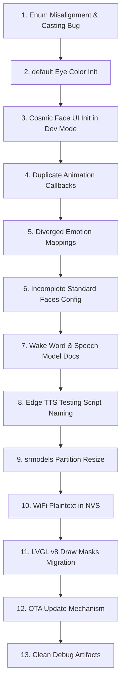

# DESKIMON V1 / V2 Fix Priority & Execution Plan

This document establishes the safety-ordered execution plan for resolving all identified codebase issues, inconsistencies, and documentation contradictions before and after the system migration.

---

## 📅 Summary of Safe Fix Order

The issues are sequenced below based on their dependencies, severity, and potential to introduce regressions.

---

## ⚡ Phase 1: High Priority (Fix BEFORE Migration)

These issues represent critical runtime bugs, initialization failures, or dev-mode validation blockers. They must be resolved to establish a stable baseline.

### 1. Enum Misalignment & Casting Bug
* **Issue ID**: ISSUE-004 (V1.1 Audit Update)
* **Severity**: 🔴 HIGH (causes active runtime state corruption)
* **Root Cause**: `spark_face_t` (in `spark_face.h`) and `eye_state_t` (in `deskimon.c`) have diverged starting at index 23 due to the insertion of `EYE_STATE_STAR_EYES` only in the UI enum. Direct integer casting between these enums assigns cosmic, charging, and battery low states to incorrect configurations.
* **Files Involved**:
  * [`SPARK-V1/firmware/main/SparkCore/spark_face.h`](file:///Users/pankaj/Desktop/DESKIMON/SPARK-V1/firmware/main/SparkCore/spark_face.h)
  * [`SPARK-V1/firmware/main/LVGL_UI/deskimon.c`](file:///Users/pankaj/Desktop/DESKIMON/SPARK-V1/firmware/main/LVGL_UI/deskimon.c)
* **Functions Involved**: `set_eyes_state()`, `logic_timer_cb()`
* **Estimated Difficulty**: Medium
* **Risk of Fixing**: Medium (requires checking all state transition logic in `deskimon.c` that relies on the misaligned enum indices)
* **Dependencies**: None
* **Safe Order to Fix**: Fix first (resolves state machine drift)
* **Verification Steps**: Enable logs during state transitions, trigger a cosmic face (e.g., Comet Rush) from the core, and verify the UI state maps to the correct cosmic state instead of falling back or drifting.
* **Migration Timing**: Fix **BEFORE** migration.

### 2. Default Eye Color Initialized to Black
* **Issue ID**: ISSUE-013
* **Severity**: 🟠 MEDIUM (makes the device appear dead on boot if NVS fails)
* **Root Cause**: If the Wi-Fi provisioning or Supabase sync fails to load the eye color from NVS, the global `s_eye_color_hex` defaults to `0x000000` (black eyes on a black background), rendering the display invisible.
* **Files Involved**:
  * [`SPARK-V1/firmware/main/LVGL_UI/deskimon.c`](file:///Users/pankaj/Desktop/DESKIMON/SPARK-V1/firmware/main/LVGL_UI/deskimon.c)
* **Functions Involved**: Global variables declarations, `Deskimon_Start()`
* **Estimated Difficulty**: Low
* **Risk of Fixing**: Extremely Low
* **Dependencies**: None
* **Safe Order to Fix**: Fix second (trivial initialization update)
* **Verification Steps**: Wipe the NVS flash partition, boot the device, and verify that the eyes initialize with the default signature cyan (`0x1AC8DB`) instead of remaining black.
* **Migration Timing**: Fix **BEFORE** migration.

### 3. Face Dev Mode Cosmic UI Initialization Gap
* **Issue ID**: AUDIT-001 (Cosmic Dev Mode Blank Screen)
* **Severity**: 🔴 HIGH (blocks visual validation of 8 cosmic faces in Dev Mode)
* **Root Cause**: In Face Dev Mode (`SPARK_FACE_DEV_MODE 1`), `Deskimon_FaceDevMode_Start()` does not initialize the cosmic widgets (`cosmic_particle`, `cosmic_ring`, etc.) because their initialization is wrapped in `#if SPARK_DEVELOPER_PREVIEW_MODE` (which is disabled in Dev Mode) in `Deskimon_Start()`. Cosmic face transitions run safely but render nothing.
* **Files Involved**:
  * [`SPARK-V1/firmware/main/LVGL_UI/deskimon.c`](file:///Users/pankaj/Desktop/DESKIMON/SPARK-V1/firmware/main/LVGL_UI/deskimon.c)
* **Functions Involved**: `Deskimon_FaceDevMode_Start()`, `Deskimon_Start()`, `dev_mode_load_face()`
* **Estimated Difficulty**: Medium
* **Risk of Fixing**: Low (relocates/shares widget creation code blocks)
* **Dependencies**: None
* **Safe Order to Fix**: Fix third (unlocks verification of subsequent animation fixes)
* **Verification Steps**: Start the device in Face Dev Mode, advance to a cosmic face (e.g., Comet Rush, Supernova), and verify that the particles and rings render on screen instead of showing a black screen.
* **Migration Timing**: Fix **BEFORE** migration.

### 4. Cosmic Face NULL-Pointer Risk in Dev Mode
* **Issue ID**: ISSUE-001
* **Severity**: 🔴 HIGH (potential Guru Meditation / hard fault crash)
* **Root Cause**: During face transitions in Dev Mode, `destroy_active_face()` deletes the active widget tree and sets static pointers to `NULL`. The 100ms timer callback `dev_mode_timer_cb` calls `Spark_Cosmic_Tick()`, which retrieves these pointers via `Spark_UI_GetObj()`. If the timer fires mid-transition before the new widgets are created, operations are performed on `NULL` pointers.
* **Files Involved**:
  * [`SPARK-V1/firmware/main/SparkCore/spark_cosmic.c`](file:///Users/pankaj/Desktop/DESKIMON/SPARK-V1/firmware/main/SparkCore/spark_cosmic.c)
  * [`SPARK-V1/firmware/main/LVGL_UI/deskimon.c`](file:///Users/pankaj/Desktop/DESKIMON/SPARK-V1/firmware/main/LVGL_UI/deskimon.c)
* **Functions Involved**: `dev_mode_timer_cb()`, `Spark_Cosmic_Tick()`, `destroy_active_face()`
* **Estimated Difficulty**: Low
* **Risk of Fixing**: Low
* **Dependencies**: None
* **Safe Order to Fix**: Fix fourth
* **Verification Steps**: Run Face Dev Mode transitions in a loop and verify that no system crashes or memory access violations occur.
* **Migration Timing**: Fix **BEFORE** migration.

### 5. Duplicate Animation Callbacks & Races
* **Issue ID**: ISSUE-002
* **Severity**: 🟠 MEDIUM (causes graphic glitches and property conflicts)
* **Root Cause**: `deskimon.c` defines its own private animation callbacks (e.g., `set_width_cb`) which duplicate `spark_animation.c`'s callbacks. Because they compile to different function pointers, `lv_anim_del()` cannot delete animations started by the other module, allowing two animations to target the same property simultaneously.
* **Files Involved**:
  * [`SPARK-V1/firmware/main/LVGL_UI/deskimon.c`](file:///Users/pankaj/Desktop/DESKIMON/SPARK-V1/firmware/main/LVGL_UI/deskimon.c)
  * [`SPARK-V1/firmware/main/SparkCore/spark_animation.c`](file:///Users/pankaj/Desktop/DESKIMON/SPARK-V1/firmware/main/SparkCore/spark_animation.c)
* **Functions Involved**: `set_width_cb`, `set_height_cb`, `set_tx_cb`, `set_ty_cb`
* **Estimated Difficulty**: Medium
* **Risk of Fixing**: Medium (requires checking all callers of these callbacks to ensure parameters aren't broken during consolidation)
* **Dependencies**: None
* **Safe Order to Fix**: Fix fifth
* **Verification Steps**: Trigger a conversational face transition while the idle look-around animation is playing and confirm the eyes transition smoothly without flickering or snapping.
* **Migration Timing**: Fix **BEFORE** migration.

### 6. Diverged Emotion Mappings
* **Issue ID**: ISSUE-005
* **Severity**: 🟠 MEDIUM (breaks cloud-initiated emotion transitions)
* **Root Cause**: `Spark_Emotion_Set()` (in `spark_emotion.c`) and `Deskimon_SetEmotion()` (in `deskimon.c`) duplicate mapping logic but have diverged. `Deskimon_SetEmotion()` lacks configurations for `"bored"`, `"blush"`, `"chill"`, and `"normal"`.
* **Files Involved**:
  * [`SPARK-V1/firmware/main/SparkCore/spark_emotion.c`](file:///Users/pankaj/Desktop/DESKIMON/SPARK-V1/firmware/main/SparkCore/spark_emotion.c)
  * [`SPARK-V1/firmware/main/LVGL_UI/deskimon.c`](file:///Users/pankaj/Desktop/DESKIMON/SPARK-V1/firmware/main/LVGL_UI/deskimon.c)
* **Functions Involved**: `Spark_Emotion_Set()`, `Deskimon_SetEmotion()`
* **Estimated Difficulty**: Low
* **Risk of Fixing**: Low
* **Dependencies**: Enum Misalignment & Casting Bug (ISSUE-004)
* **Safe Order to Fix**: Fix sixth (dependent on aligned face enums)
* **Verification Steps**: Trigger a `"bored"` emotion tag from the backend Supabase preference update and verify the device successfully renders the BORED face rather than defaulting to NORMAL.
* **Migration Timing**: Fix **BEFORE** migration.

---

## ⚡ Phase 2: Moderate Priority (Fix DURING Migration)

These issues represent configuration mismatches, naming errors, and documentation corrections that should be cleaned up during the migration process.

### 7. Wake Word & Speech Model Documentation Mismatch
* **Issue ID**: AUDIT-002
* **Severity**: 🟠 MEDIUM (causes major onboarding confusion)
* **Root Cause**: Documentation states the wake word is "Hi Lexi" (referencing `CONFIG_SR_WN_WN9_HILEXIN`), whereas the `sdkconfig` actually enables `CONFIG_SR_WN_WN9_HIESP` ("Hi ESP") and defines MultiNet command phrases `"Spark"`, `"Hi Spark"`, and `"Hey Spark"` (command IDs 5, 6, 7) which `MIC_Speech.c` listens for.
* **Files Involved**:
  * [`SPARK-V1/firmware/sdkconfig`](file:///Users/pankaj/Desktop/DESKIMON/SPARK-V1/firmware/sdkconfig)
  * [`SPARK-V1/firmware/main/MIC_Driver/MIC_Speech.c`](file:///Users/pankaj/Desktop/DESKIMON/SPARK-V1/firmware/main/MIC_Driver/MIC_Speech.c)
  * Project documentation files (`08_DEBUG_GUIDE.md`, `12_BUILD_PIPELINE.md`, etc.)
* **Functions Involved**: `detect_task()`
* **Estimated Difficulty**: Low
* **Risk of Fixing**: Low
* **Dependencies**: None
* **Safe Order to Fix**: Fix seventh (can be done during doc audit review)
* **Verification Steps**: Update documentation to align with the actual firmware commands, speak `"Hi Spark"` or `"Hey Spark"` in production mode, and verify that conversation recording triggers.
* **Migration Timing**: Fix **BEFORE or DURING** migration.

### 8. Edge TTS Testing Script Naming Confusion
* **Issue ID**: AUDIT-003
* **Severity**: 🟡 LOW (onboarding friction)
* **Root Cause**: `22_NEXT_SESSION.md` lists `node test_edge_tts.js` to test Edge TTS, but that script actually tests ElevenLabs. Edge TTS testing resides in `test_tts.js`.
* **Files Involved**:
  * [`webapp/test_edge_tts.js`](file:///Users/pankaj/Desktop/DESKIMON/webapp/test_edge_tts.js)
  * [`webapp/test_tts.js`](file:///Users/pankaj/Desktop/DESKIMON/webapp/test_tts.js)
  * [`BRAIN_SPARK/22_NEXT_SESSION.md`](file:///Users/pankaj/Desktop/DESKIMON/BRAIN_SPARK/22_NEXT_SESSION.md)
* **Functions Involved**: N/A
* **Estimated Difficulty**: Low (rename script and update documentation)
* **Risk of Fixing**: Extremely Low
* **Dependencies**: None
* **Safe Order to Fix**: Fix eighth
* **Verification Steps**: Run the test scripts and verify the output matches their documented purposes.
* **Migration Timing**: Fix **BEFORE or DURING** migration.

### 9. `srmodels` Partition Nearly Full
* **Issue ID**: ISSUE-006
* **Severity**: 🟡 LOW (currently safe, but blocks future voice model upgrades)
* **Root Cause**: The `srmodels` partition is 2.5MB, and `srmodels.bin` occupies ~2.4MB, leaving only 150KB of headroom.
* **Files Involved**:
  * [`SPARK-V1/firmware/partitions.csv`](file:///Users/pankaj/Desktop/DESKIMON/SPARK-V1/firmware/partitions.csv)
* **Functions Involved**: N/A
* **Estimated Difficulty**: Low (requires updating partitions offsets)
* **Risk of Fixing**: Medium (shifting partition offsets requires wiping and re-flashing stored NVS parameters)
* **Dependencies**: Flash size constraints
* **Safe Order to Fix**: Fix ninth
* **Verification Steps**: Flash the re-partitioned binary and verify the device boots and reads models without overlap errors.
* **Migration Timing**: Fix **DURING or AFTER** migration.

---

## ⚡ Phase 3: Low/Future Priority (Fix AFTER Migration)

These represent deep structural refactoring, security enhancements, or features that require significant rewriting and should be tackled after the primary migration is complete.

### 10. Plaintext WiFi Credentials in NVS
* **Issue ID**: ISSUE-007
* **Severity**: 🟡 LOW (security vulnerability)
* **Root Cause**: Wi-Fi credentials and Supabase auth keys are written to NVS sectors in plaintext because flash encryption is not enabled.
* **Files Involved**:
  * [`SPARK-V1/firmware/main/Provisioning/Provisioning.c`](file:///Users/pankaj/Desktop/DESKIMON/SPARK-V1/firmware/main/Provisioning/Provisioning.c)
* **Functions Involved**: `Provisioning_Init()`, `Provisioning_SaveConfig()`
* **Estimated Difficulty**: Medium (requires configuring bootloader for Flash Encryption)
* **Risk of Fixing**: High (hardware fuses on the ESP32-S3 must be burned, which complicates direct developer flashing)
* **Dependencies**: ESP-IDF bootloader setup
* **Safe Order to Fix**: Fix tenth
* **Verification Steps**: Dump the NVS partition using `esptool.py` and verify that Wi-Fi credentials cannot be parsed in plaintext.
* **Migration Timing**: Fix **AFTER** migration (deploy during final production hardening).

### 11. LVGL v8 Draw Masks Migration Blocker
* **Issue ID**: ISSUE-008
* **Severity**: 🔴 HIGH (blocks LVGL v9 migration, LOW currently)
* **Root Cause**: Custom diagonal masks on the eyes and mouth shapes rely on the LVGL v8 mask API (`lv_draw_mask_line_points_init()`), which was completely removed in LVGL v9.
* **Files Involved**:
  * [`SPARK-V1/firmware/main/LVGL_UI/deskimon.c`](file:///Users/pankaj/Desktop/DESKIMON/SPARK-V1/firmware/main/LVGL_UI/deskimon.c)
* **Functions Involved**: `eye_mask_event_cb()`, `happy_mouth_mask_event_cb()`, `wtf_mouth_mask_event_cb()`
* **Estimated Difficulty**: High (requires rewriting clipping logic)
* **Risk of Fixing**: High (clipping visual artifacts might occur)
* **Dependencies**: LVGL v9 migration task
* **Safe Order to Fix**: Fix eleventh
* **Verification Steps**: Migrate the workspace to LVGL v9, compile, and confirm the diagonal cuts render properly.
* **Migration Timing**: Fix **DURING** the LVGL v9 migration.

### 12. No OTA Update Mechanism
* **Issue ID**: ISSUE-010
* **Severity**: 🟠 MEDIUM (operational risk)
* **Root Cause**: The partition table lacks `ota_0` and `ota_1` boot slots, and the firmware contains no code to retrieve, write, or validate new binary updates.
* **Files Involved**:
  * [`SPARK-V1/firmware/partitions.csv`](file:///Users/pankaj/Desktop/DESKIMON/SPARK-V1/firmware/partitions.csv)
  * [`SPARK-V1/firmware/main/main.c`](file:///Users/pankaj/Desktop/DESKIMON/SPARK-V1/firmware/main/main.c)
* **Functions Involved**: State transitions to `SPARK_STATE_UPDATING`
* **Estimated Difficulty**: High
* **Risk of Fixing**: Medium
* **Dependencies**: Server-side update manager
* **Safe Order to Fix**: Fix twelfth
* **Verification Steps**: Trigger an OTA update via the dashboard and confirm the device writes, validates, and boots into the new firmware.
* **Migration Timing**: Fix **AFTER** migration.

### 13. Clean Debug Artifacts from SparkCore
* **Issue ID**: AUDIT-004 (Leftover Files)
* **Severity**: 🟡 LOW (maintenance overhead)
* **Root Cause**: Legacy development debris, step backups, and reconstruction logs remain in the source folder.
* **Files Involved**:
  * `SparkCore/missing_block.txt`
  * `SparkCore/spark_cosmic_all_steps.txt`
  * `SparkCore/spark_cosmic.c.extracted*`
  * `SparkCore/spark_cosmic.c.reconstructed`
  * `SparkCore/spark_cosmic.c.recovered`
  * `SparkCore/spark_cosmic.c.step2230`
  * `SparkCore/transcript_matches.txt`
* **Functions Involved**: N/A
* **Estimated Difficulty**: Extremely Low
* **Risk of Fixing**: Low (ensure no active files are deleted)
* **Dependencies**: None
* **Safe Order to Fix**: Can be done at any time
* **Verification Steps**: Remove files, clean build directory (`idf.py clean`), and compile (`idf.py build`) to ensure no dependency matches are broken.
* **Migration Timing**: Clean **AFTER** migration is finalized.
