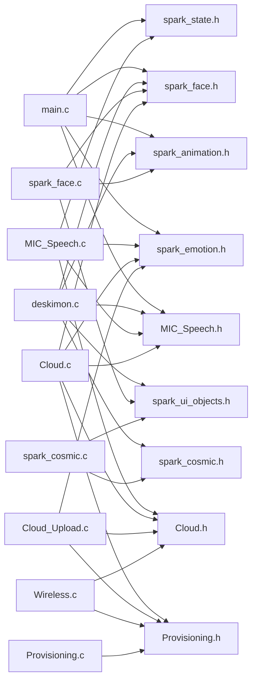

# 05 — DEPENDENCY GRAPH

This document maps the structural code dependencies of the Deskimon system. It includes Mermaid diagrams showing firmware-level include links, driver layers, and the communication links between the device and the cloud backend.

---

## 1. System Overview Dependency Architecture

```mermaid
graph TD
    %% Define styles
    classDef main fill:#f9f,stroke:#333,stroke-width:2px;
    classDef core fill:#bbf,stroke:#333,stroke-width:1px;
    classDef ui fill:#bfb,stroke:#333,stroke-width:1px;
    classDef driver fill:#fbb,stroke:#333,stroke-width:1px;
    classDef cloud fill:#fbf,stroke:#333,stroke-width:1px;
    classDef server fill:#ffb,stroke:#333,stroke-width:2px;

    %% Nodes
    Main["main.c"]:::main
    
    subgraph SparkCore ["SparkCore (Abstraction)"]
        Face["spark_face.c"]:::core
        Anim["spark_animation.c"]:::core
        Cosmic["spark_cosmic.c"]:::core
        State["spark_state.c"]:::core
        Emotion["spark_emotion.c"]:::core
        UIObj["spark_ui_objects.h"]:::core
    end

    subgraph UI ["Graphics Engine"]
        Deskimon["LVGL_UI/deskimon.c"]:::ui
    end

    subgraph AudioPipeline ["Voice Capture & Audio"]
        MicSpeech["MIC_Driver/MIC_Speech.c"]:::driver
        PCM5101["Audio_Driver/PCM5101.c"]:::driver
    end

    subgraph NetworkCloud ["Network & Config Manager"]
        Wireless["Wireless/Wireless.c"]:::cloud
        Provisioning["Provisioning/Provisioning.c"]:::cloud
        CloudCore["Cloud/Cloud.c"]:::cloud
        CloudUpload["Cloud/Cloud_Upload.c"]:::cloud
    end

    subgraph HardwareDrivers ["Peripheral Drivers"]
        IMU["QMI8658.c"]:::driver
        RTC["PCF85063.c"]:::driver
        BAT["BAT_Driver.c"]:::driver
        EXIO["TCA9554PWR.c"]:::driver
        LCD["Display_SPD2010.c"]:::driver
        Touch["Touch_SPD2010.c"]:::driver
    end

    subgraph Backend ["Next.js Backend Server"]
        Daemon["server_daemon.js"]:::server
        Matcher["intent_matcher.js"]:::server
        Memory["memory_system.js"]:::server
        TTS["tts_provider.js"]:::server
    end

    %% Dependency Arrows
    Main --> HardwareDrivers
    Main --> SparkCore
    Main --> UI
    Main --> AudioPipeline

    %% UI to Core/Drivers
    Deskimon --> Face
    Deskimon --> Anim
    Deskimon --> UIObj
    Deskimon --> Cosmic
    Deskimon --> MicSpeech
    Deskimon --> IMU
    Deskimon --> Touch
    
    %% Audio Pipeline
    MicSpeech --> State
    MicSpeech --> Emotion
    MicSpeech --> PCM5101
    MicSpeech --> CloudUpload

    %% Cloud / Network
    Wireless --> Provisioning
    Wireless --> CloudCore
    CloudCore --> Deskimon
    CloudCore --> Provisioning
    CloudUpload --> Provisioning
    CloudUpload --> PCM5101

    %% Hardware
    LCD --> HardwareDrivers
    
    %% Network Boundaries
    CloudUpload -.->|HTTP POST WAV / GET MP3| Daemon
    CloudCore -.->|Supabase WebSocket| Daemon
    
    %% Backend internal
    Daemon --> Matcher
    Daemon --> Memory
    Daemon --> TTS
```

---

## 2. Firmware Compilation Dependents

This diagram illustrates how changes to header files propagate through the firmware build tree (source files depending on specific header includes):

---

## 3. Key Observations & Coupling Issues

1. **Circular Synchronization Loop**: `Cloud.c` relies on parsing state changes and updating the display via `Deskimon_SetEyeColor()`. The main `deskimon.c` module relies on polling variables set in the `Cloud` task. While technically decoupled by using static flags in RAM rather than blocking calls, it creates an implicit runtime execution loop.
2. **Implicit Enum Casting**: `deskimon.c` cast-assigns `eye_state_t` values to `spark_face_t` in `set_eyes_state()`. This creates a critical compile-time dependency where `SparkCore/spark_face.h` must maintain identical integer enum offsets to `LVGL_UI/deskimon.c` state structures.
3. **Private Callback Duplications**: The `deskimon.c` rendering component contains private local duplications of standard `spark_animation.c` callbacks. Because they are compiled into different translation units, the LVGL engine is unable to link them for cancellation requests, creating runtime race conflicts.
