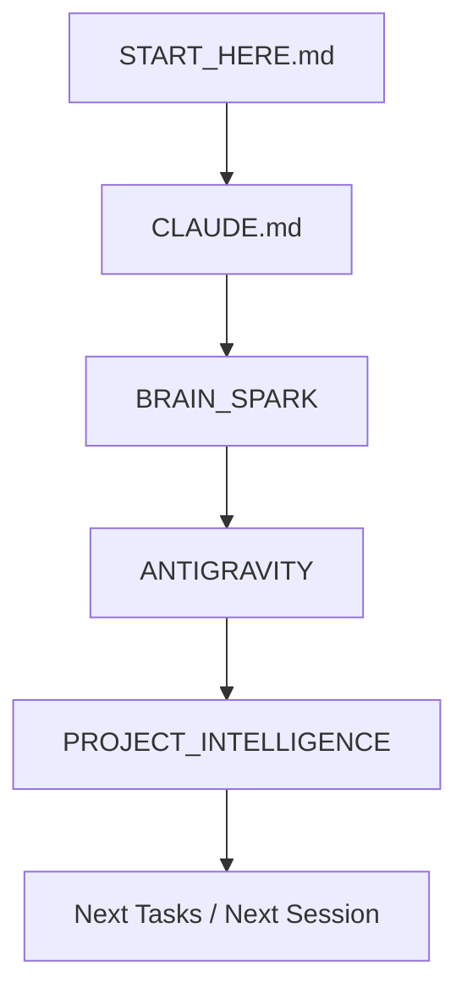

# 🚀 START HERE: DESKIMON AI ONBOARDING

Welcome to **Deskimon**! This file serves as the permanent starting point and onboarding guide for every future AI coding session. 

Before you write any code, query any APIs, or propose any modifications, you must read the project documentation in the specific sequence outlined below. This ensures you fully grasp the hardware limitations, layered architecture, state machines, and personality constraints of the Deskimon project.

---

## 🗺️ Project Documentation Map

Our documentation is structured into three specialized directories in the project root:

### 1. [BRAIN_SPARK](file:///Users/pankaj/Desktop/DESKIMON/BRAIN_SPARK/) — Product, Lore, & State
Contains the conceptual design, personality parameters, product roadmap, and current implementation milestones.
* 🧠 **Key Context**: [00_PROJECT_VISION.md](file:///Users/pankaj/Desktop/DESKIMON/BRAIN_SPARK/00_PROJECT_VISION.md) & [01_PRODUCT_IDENTITY.md](file:///Users/pankaj/Desktop/DESKIMON/BRAIN_SPARK/01_PRODUCT_IDENTITY.md)
* 📊 **Current Status**: [03_CURRENT_STATE.md](file:///Users/pankaj/Desktop/DESKIMON/BRAIN_SPARK/03_CURRENT_STATE.md) & [04_FEATURE_STATUS.md](file:///Users/pankaj/Desktop/DESKIMON/BRAIN_SPARK/04_FEATURE_STATUS.md)
* 🎭 **Personality & Tone**: [05_PERSONALITY.md](file:///Users/pankaj/Desktop/DESKIMON/BRAIN_SPARK/05_PERSONALITY.md) & [07_DECISIONS.md](file:///Users/pankaj/Desktop/DESKIMON/BRAIN_SPARK/07_DECISIONS.md)
* 🤖 **AI Guidelines**: [20_AI_CONTEXT.md](file:///Users/pankaj/Desktop/DESKIMON/BRAIN_SPARK/20_AI_CONTEXT.md) & [21_AI_RULES.md](file:///Users/pankaj/Desktop/DESKIMON/BRAIN_SPARK/21_AI_RULES.md)

### 2. [ANTIGRAVITY](file:///Users/pankaj/Desktop/DESKIMON/ANTIGRAVITY/) — Embedded Firmware Architecture
Contains low-level technical documentation for the ESP32-S3 firmware, drivers, memory layouts, and subsystem components.
* 🏗️ **Core Architecture**: [01_ARCHITECTURE.md](file:///Users/pankaj/Desktop/DESKIMON/ANTIGRAVITY/01_ARCHITECTURE.md) & [02_FOLDER_MAP.md](file:///Users/pankaj/Desktop/DESKIMON/ANTIGRAVITY/02_FOLDER_MAP.md)
* 👁️ **Visual Engines**: [05_FACE_SYSTEM.md](file:///Users/pankaj/Desktop/DESKIMON/ANTIGRAVITY/05_FACE_SYSTEM.md) & [06_ANIMATION_SYSTEM.md](file:///Users/pankaj/Desktop/DESKIMON/ANTIGRAVITY/06_ANIMATION_SYSTEM.md)
* 🎙️ **Peripherals**: [09_VOICE_PIPELINE.md](file:///Users/pankaj/Desktop/DESKIMON/ANTIGRAVITY/09_VOICE_PIPELINE.md) & [12_HARDWARE_INTERFACE.md](file:///Users/pankaj/Desktop/DESKIMON/ANTIGRAVITY/12_HARDWARE_INTERFACE.md)
* ⚙️ **Onboarding**: [17_ENGINEER_ONBOARDING.md](file:///Users/pankaj/Desktop/DESKIMON/ANTIGRAVITY/17_ENGINEER_ONBOARDING.md)

### 3. [PROJECT_INTELLIGENCE](file:///Users/pankaj/Desktop/DESKIMON/PROJECT_INTELLIGENCE/) — Navigation & Safe Editing
Contains code indexers, event flow graphs, safety constraints, build-and-flash pipelines, and detailed debugging checklists.
* 📂 **Navigation Index**: [01_PROJECT_INDEX.md](file:///Users/pankaj/Desktop/DESKIMON/PROJECT_INTELLIGENCE/01_PROJECT_INDEX.md) & [04_MODULE_INDEX.md](file:///Users/pankaj/Desktop/DESKIMON/PROJECT_INTELLIGENCE/04_MODULE_INDEX.md)
* 🛠️ **Pipelines**: [12_BUILD_PIPELINE.md](file:///Users/pankaj/Desktop/DESKIMON/PROJECT_INTELLIGENCE/12_BUILD_PIPELINE.md) & [14_RUNTIME_PIPELINE.md](file:///Users/pankaj/Desktop/DESKIMON/PROJECT_INTELLIGENCE/14_RUNTIME_PIPELINE.md)
* 🛡️ **Safety**: [10_SAFE_EDIT_GUIDE.md](file:///Users/pankaj/Desktop/DESKIMON/PROJECT_INTELLIGENCE/10_SAFE_EDIT_GUIDE.md) & [18_KNOWN_RISKS.md](file:///Users/pankaj/Desktop/DESKIMON/PROJECT_INTELLIGENCE/18_KNOWN_RISKS.md)
* 🩺 **Diagnostics**: [08_DEBUG_GUIDE.md](file:///Users/pankaj/Desktop/DESKIMON/PROJECT_INTELLIGENCE/08_DEBUG_GUIDE.md) & [17_DEBUG_CHECKLIST.md](file:///Users/pankaj/Desktop/DESKIMON/PROJECT_INTELLIGENCE/17_DEBUG_CHECKLIST.md)

---

## 🔄 AI Onboarding Sequence (Boot Process)

To align your environment and context with this repository, read the files in the following **exact order**:

### 1. First: This File (`START_HERE.md`)
Understand the layout and read order of the documentation.

### 2. Second: Core Instructions (`CLAUDE.md`)
Read [CLAUDE.md](file:///Users/pankaj/Desktop/DESKIMON/CLAUDE.md) located in the project root. This contains all permanent development rules, debugging workflows, documentation pipelines, and codebase-specific hazards (e.g., thread-safety, dev mode limitations).

### 3. Third: Conceptual Alignment (`BRAIN_SPARK/`)
Read the following files to align with the current product state and AI personality:
1. [00_PROJECT_VISION.md](file:///Users/pankaj/Desktop/DESKIMON/BRAIN_SPARK/00_PROJECT_VISION.md) - Conceptual vision of Deskimon.
2. [03_CURRENT_STATE.md](file:///Users/pankaj/Desktop/DESKIMON/BRAIN_SPARK/03_CURRENT_STATE.md) - What is implemented vs. disabled.
3. [20_AI_CONTEXT.md](file:///Users/pankaj/Desktop/DESKIMON/BRAIN_SPARK/20_AI_CONTEXT.md) - Embedded C vs. Node.js server boundaries.
4. [22_NEXT_SESSION.md](file:///Users/pankaj/Desktop/DESKIMON/BRAIN_SPARK/22_NEXT_SESSION.md) - Exact tasks left off in the previous session.

### 4. Fourth: Technical Architecture (`ANTIGRAVITY/`)
Read these to understand how the firmware functions:
1. [01_ARCHITECTURE.md](file:///Users/pankaj/Desktop/DESKIMON/ANTIGRAVITY/01_ARCHITECTURE.md) - Boot and event data flows.
2. [05_FACE_SYSTEM.md](file:///Users/pankaj/Desktop/DESKIMON/ANTIGRAVITY/05_FACE_SYSTEM.md) - Core procedural eye rendering, geometry tables, and layouts.
3. [06_ANIMATION_SYSTEM.md](file:///Users/pankaj/Desktop/DESKIMON/ANTIGRAVITY/06_ANIMATION_SYSTEM.md) - Easing functions, transitions, and the `lv_anim_t` wrapper API.

### 5. Fifth: Execution Safety (`PROJECT_INTELLIGENCE/`)
Read these to safely write, build, and debug:
1. [10_SAFE_EDIT_GUIDE.md](file:///Users/pankaj/Desktop/DESKIMON/PROJECT_INTELLIGENCE/10_SAFE_EDIT_GUIDE.md) - Files you may edit vs. restricted drivers/files.
2. [08_DEBUG_GUIDE.md](file:///Users/pankaj/Desktop/DESKIMON/PROJECT_INTELLIGENCE/08_DEBUG_GUIDE.md) - Detailed diagnostic checklists per subsystem.

---

## 🛠️ Essential Project Structure

* **Firmware Source Root**: `/Users/pankaj/Desktop/DESKIMON/SPARK-V1/firmware/main/`
  * Core Entry: [`main.c`](file:///Users/pankaj/Desktop/DESKIMON/SPARK-V1/firmware/main/main.c)
  * UI Logic & Timers: [`LVGL_UI/deskimon.c`](file:///Users/pankaj/Desktop/DESKIMON/SPARK-V1/firmware/main/LVGL_UI/deskimon.c)
  * Face Configurations: [`SparkCore/spark_face.c`](file:///Users/pankaj/Desktop/DESKIMON/SPARK-V1/firmware/main/SparkCore/spark_face.c)
  * Hardware Interface: [`SparkCore/spark_hardware.c`](file:///Users/pankaj/Desktop/DESKIMON/SPARK-V1/firmware/main/SparkCore/spark_hardware.c)
* **Backend Source Root**: `/Users/pankaj/Desktop/DESKIMON/webapp/`
  * Daemon Entry: [`server_daemon.js`](file:///Users/pankaj/Desktop/DESKIMON/webapp/server_daemon.js)
  * Intent Rules: [`intents.json`](file:///Users/pankaj/Desktop/DESKIMON/webapp/intents.json)
  * Memory Engine: [`memory_system.js`](file:///Users/pankaj/Desktop/DESKIMON/webapp/memory_system.js)

Now, proceed immediately to **[CLAUDE.md](file:///Users/pankaj/Desktop/DESKIMON/CLAUDE.md)** to review developer rules and constraints.
